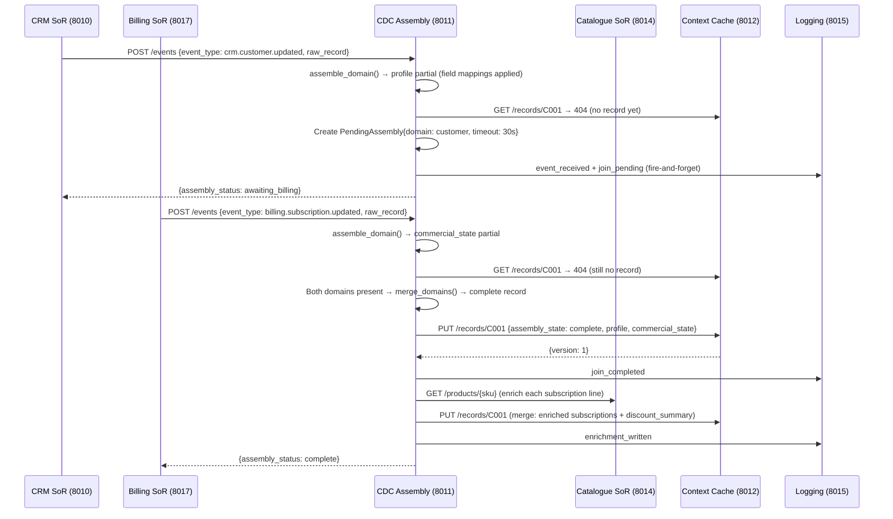
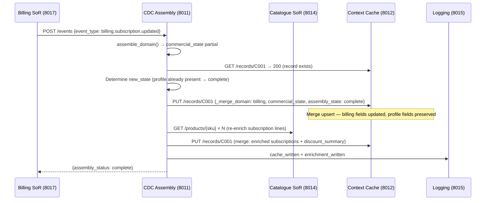
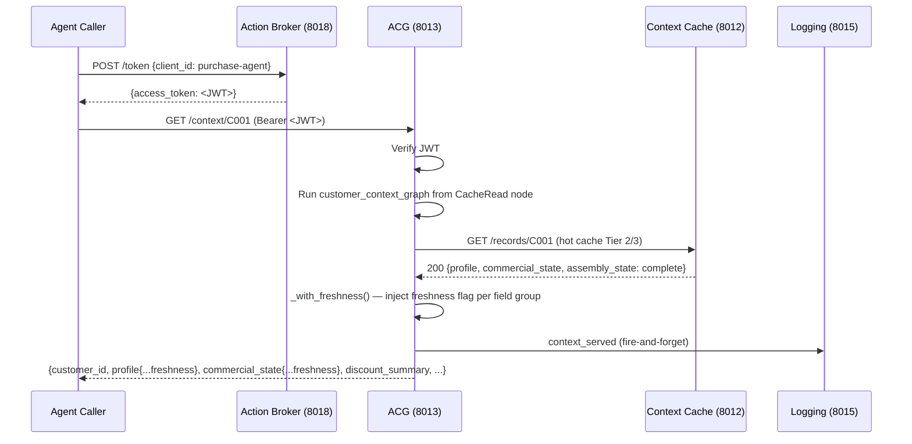
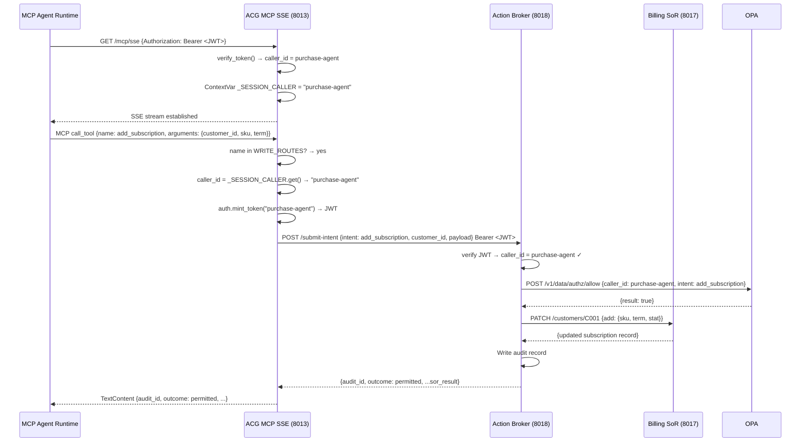
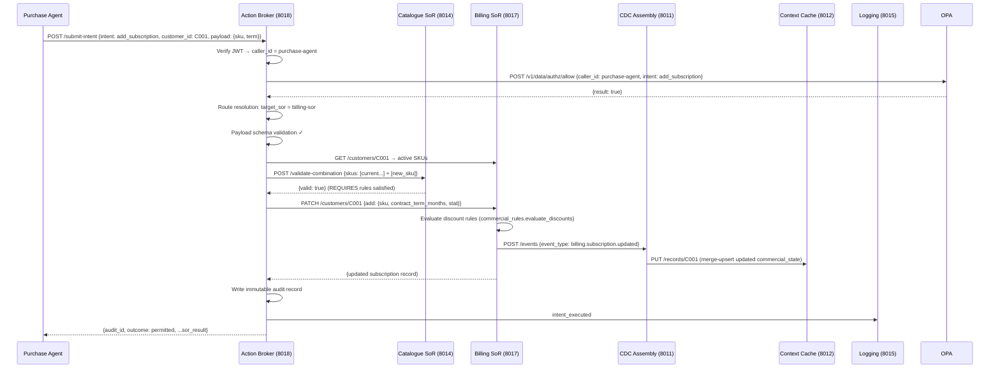
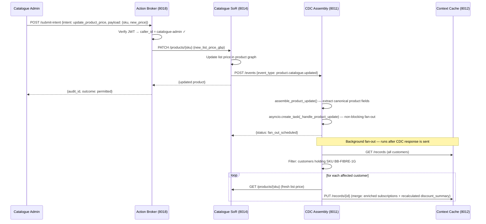
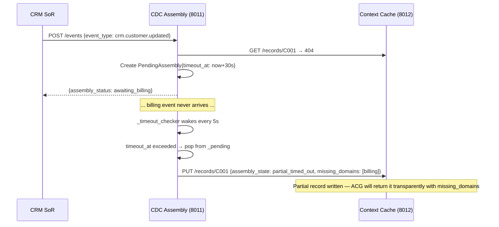

# Business Context Layer — Demo

A runnable demonstration of the **Business Context Layer** from the Enterprise Agentic Architecture design. It implements the event-driven assembly pipeline that underpins how agents retrieve and mutate customer context in a Telco setting.

The demo is scoped to one CX slice — **customer product holdings** — and shows how raw data from heterogeneous Systems of Record is assembled into a clean, governed, canonical context packet that any agent can consume without knowing which SoRs exist or how they are structured.

---

## High-level architecture

```
┌─────────────────────────────────────────────────────────────────────────────┐
│  AGENTIC LAYER                                                              │
│                                                                             │
│  ┌──────────────────────────────────┐   ┌───────────────────────────────┐  │
│  │  Agent Context Gateway (ACG)     │   │  Action Broker                │  │
│  │  Port 8013                       │   │  Port 8018                    │  │
│  │                                  │   │                               │  │
│  │  • Two-tier cache-first read     │   │  • JWT auth + permission gate │  │
│  │  • pydantic-graph retrieval plan │   │  • Write route resolution     │  │
│  │  • MCP SSE server                │   │  • Payload schema validation  │  │
│  │  • Compatible offers endpoint    │   │  • Immutable audit log        │  │
│  │  • Freshness evaluation at read  │   │  • Forwards to SoR on pass    │  │
│  └──────┬────────────────┬──────────┘   └────────────┬──────────────────┘  │
│         │ reads          │ reads                      │ writes              │
└─────────┼────────────────┼────────────────────────────┼─────────────────────┘
          │                │                            │
┌─────────┼────────────────┼────────────────────────────┼─────────────────────┐
│  BUSINESS CONTEXT LAYER  │                            │                     │
│                          ▼                            │                     │
│  ┌───────────────────────────────────┐               │                     │
│  │  Context Cache                    │               │                     │
│  │  Port 8012                        │               │                     │
│  │                                   │               │                     │
│  │  Tier 1: Permanent store (all     │               │                     │
│  │          known customers — never  │               │                     │
│  │          evicted)                 │               │                     │
│  │  Tier 2/3: Hot cache (evictable)  │               │                     │
│  │                                   │◄──────────────────────────┐         │
│  │  PUT /records/{id}  (CDC writes)  │               │           │         │
│  │  GET /records/{id}  (ACG reads)   │               │           │writes   │
│  └───────────────────────────────────┘               │           │         │
│                  ▲                                    │           │         │
│                  │ writes assembled records           │           │         │
│  ┌───────────────┴────────────────────┐              │           │         │
│  │  CDC Assembly                      │              │           │         │
│  │  Port 8011                         │              │           │         │
│  │                                    │              │           │         │
│  │  • Receives raw SoR events         │              │           │         │
│  │  • Applies ontology field mappings │              │           │         │
│  │  • Stateful join (pending store)   │              │           │         │
│  │  • 30-second timeout → partial     │              │           │         │
│  │  • Catalogue enrichment on write   │              │           │         │
│  │  • Product update fan-out          │              │           │         │
│  └────────────────────────────────────┘              │           │         │
│                  ▲ SoR events                        │           │         │
│                  │                                   │           │         │
│  ┌───────────────┴──────────────────┐                │           │         │
│  │  Offer Engine                    │                │           │         │
│  │  Port 8016                       │◄───────────────┘           │         │
│  │                                  │                             │         │
│  │  • Discount policy evaluation    │                             │         │
│  │  • Compatible offers via product │                             │         │
│  │    graph                         │                             │         │
│  │  • Before/after delta proposals  │                             │         │
│  └──────────────────────────────────┘                            │         │
│                                                                   │         │
│  ┌──────────────────────────────────────────┐                    │         │
│  │  Ontology (shared module)                │                    │         │
│  │                                          │                    │         │
│  │  • FieldMapping & FieldGroup declarations│                    │         │
│  │  • ASSEMBLY_SPEC (event → domain rules)  │                    │         │
│  │  • REQUIRED_DOMAINS (derived)            │                    │         │
│  │  • VALID_ASSEMBLY_STATES (derived)       │                    │         │
│  │  • RETRIEVAL_PLANS (per-task-type)       │                    │         │
│  │  • WRITE_ROUTES                          │                    │         │
│  │  • validate_cache_record()               │                    │         │
│  └──────────────────────────────────────────┘                    │         │
│                                                                   │         │
└───────────────────────────────────────────────────────────────────┼─────────┘
                                                                    │
┌───────────────────────────────────────────────────────────────────┼─────────┐
│  SYSTEMS OF RECORD LAYER                                          │         │
│                                                                   │         │
│  ┌────────────────────┐  ┌──────────────────┐  ┌─────────────────┴──────┐  │
│  │  CRM SoR           │  │  Billing SoR     │  │  Product Catalogue SoR │  │
│  │  Port 8010         │  │  Port 8017       │  │  Port 8014             │  │
│  │                    │  │                  │  │                        │  │
│  │  Customer identity │  │  Subscriptions,  │  │  Product definitions,  │  │
│  │  seed: crm.yaml    │  │  charges, status │  │  prices, relationships │  │
│  │                    │  │  seed: billing   │  │  catalogue.yaml        │  │
│  │  Emits:            │  │  .yaml           │  │                        │  │
│  │  crm.customer      │  │                  │  │  Emits:                │  │
│  │  .updated          │  │  Emits:          │  │  product.catalogue     │  │
│  │                    │  │  billing.sub     │  │  .updated              │  │
│  └────────────────────┘  │  scription       │  └────────────────────────┘  │
│                          │  .updated        │                              │
│                          └──────────────────┘                              │
└─────────────────────────────────────────────────────────────────────────────┘

┌─────────────────────────────────────────────────────────────────────────────┐
│  CROSS-CUTTING                                                              │
│  Logging Service — Port 8015                                                │
│  Structured event log with correlation IDs. All services write here         │
│  (fire-and-forget; logging failures never interrupt the assembly path)       │
└─────────────────────────────────────────────────────────────────────────────┘
```

---

## Service index

| Port | Service | Layer | File |
|------|---------|-------|------|
| 8010 | CRM SoR | Systems of Record | `crm/crm_app.py` |
| 8011 | CDC Assembly | Business Context | `cdc/cdc_app.py` |
| 8012 | Context Cache | Business Context | `context_cache/cache_app.py` |
| 8013 | ACG + Agent UI | Agentic | `acg/acg_app.py` |
| 8014 | Product Catalogue SoR | Systems of Record | `product/catalogue_app.py` |
| 8015 | Logging Service | Cross-cutting | `log/log_app.py` |
| 8016 | Offer Engine | Business Context | `offer_engine/offer_engine_app.py` |
| 8017 | Billing SoR | Systems of Record | `billing/billing_app.py` |
| 8018 | Action Broker | Agentic | `action_broker/action_broker_app.py` |
| 8019 | OPA Policy Engine | Agentic | `policies/authz.rego` + `policies/data.json` |

---

## How to run

### Prerequisites

```bash
# Activate the shared venv
source bin/activate
pip install -r ontology/demo/requirements.txt
```

### Start all services

```bash
cd ontology/demo
./start.sh           # start services; SoRs seed the cache automatically on startup
./start.sh --no-seed # start services without auto-seeding (useful for testing cold start)
```

Start order is managed by `start.sh` — it respects service dependency order (Cache and Log first, then CDC, then SoRs, then Action Broker, then ACG).

### Verify the cache is populated

```bash
cd ontology/demo/seed
python seed.py
```

This checks that all five seed customers are assembled as `complete` in both the hot cache and the permanent store.

### Open the Agent UI

```
http://localhost:8013
```

### Stop all services

```bash
./stop.sh
```

### Useful API docs

| Service | Swagger UI |
|---------|-----------|
| ACG | http://localhost:8013/docs |
| Action Broker | http://localhost:8018/docs |
| Offer Engine | http://localhost:8016/docs |
| CDC Assembly | http://localhost:8011/docs |
| Context Cache | http://localhost:8012/docs |
| CRM SoR | http://localhost:8010/docs |
| Billing SoR | http://localhost:8017/docs |
| Product Catalogue | http://localhost:8014/docs |

---

## Seed data

### Customers (CRM SoR — `seed/crm.yaml`)

| ID | Name | Email |
|----|------|-------|
| C001 | Alice Brown | alice.brown@example.com |
| C002 | Ben Sharma | ben.sharma@example.com |
| C003 | Clare O'Brien | clare.obrien@example.com |
| C004 | David Kim | david.kim@example.com |
| C005 | Eva Müller | eva.muller@example.com |

### Products (Product Catalogue — `product/catalogue.yaml`)

| SKU | Name | Type | List Price |
|-----|------|------|-----------|
| BB-FTTC-100 | Fibre 100Mbps Broadband | broadband | £28/mo |
| BB-FIBRE-500 | Fibre 500Mbps Broadband | broadband | £38/mo |
| BB-FIBRE-1G | Fibre 1Gbps Broadband | broadband | £45/mo |
| TV-SPORTS-PKG | Sports Pack | tv | £20/mo |
| TV-FULL-HSE | Full House TV | tv | £55/mo |
| MOB-SIM-12GB | SIM-Only 12GB | mobile | £12/mo |
| MOB-5G-UNLIM | 5G Unlimited | mobile | £35/mo |
| HW-WIFI-BOOSTER | Wi-Fi Booster | hardware | £5/mo |
| HW-SKY-STREAM | Sky Stream Puck | hardware | £5/mo |
| HW-SKY-GLASS | Sky Glass TV | hardware | £10/mo |
| STRM-NETFLIX-STD | Netflix Standard (bolt-on) | streaming | £10.99/mo |
| STRM-DISNEY | Disney+ (bolt-on) | streaming | £4.99/mo |
| STRM-PARAMOUNT | Paramount+ (bolt-on) | streaming | £3.99/mo |

Products have upgrade paths (`BB-FTTC-100 → BB-FIBRE-500 → BB-FIBRE-1G`, `HW-SKY-STREAM → HW-SKY-GLASS`), cross-category compatibility edges (`BB-FIBRE-1G COMPATIBLE_WITH TV-FULL-HSE`), and prerequisite requirements (`HW-WIFI-BOOSTER REQUIRES any broadband`, `STRM-NETFLIX-STD REQUIRES any TV package`). The product graph is used by the Offer Engine to identify valid upsell candidates and by the Action Broker to validate proposed additions against a customer's existing portfolio.

---

## Example journeys

Two scripted demonstrations are included:

### 1. Purchase journey (`purchase_journey.py`)

Walks an agent through a governed product purchase for a customer.

```bash
cd ontology/demo
python purchase_journey.py                            # default: C001, purchase-agent identity
python purchase_journey.py C002                       # different customer
python purchase_journey.py --client-id catalogue-admin  # triggers 403 — wrong permissions
python purchase_journey.py --client-id unknown-bot      # triggers 401 — token rejected
```

**Steps:**
1. Authenticate — acquires a JWT from the Action Broker's `/token` endpoint
2. Query current holdings — reads the customer's assembled context from the ACG
3. Browse compatible offers — ACG calls the Offer Engine to walk the product graph and compute per-term savings proposals
4. Submit purchase intent — posts `add_subscription` to the Action Broker
5. Validate updated holdings — re-reads the ACG to confirm the new subscription appears

The journey deliberately tests the permission boundary: running with `--client-id catalogue-admin` shows the Action Broker rejecting the write (catalogue-admin cannot submit `add_subscription`).

### 2. Pricing journey (`pricing_journey.py`)

Walks a catalogue administrator through a product price update and observes the CDC fan-out that re-enriches all affected customers.

```bash
cd ontology/demo
python pricing_journey.py
```

**Steps:**
1. Authenticate as `catalogue-admin`
2. Query a product's current list price
3. Submit `update_product_price` intent via the Action Broker
4. Observe CDC fan-out — the catalogue update triggers CDC to re-enrich the `commercial_state` of every customer holding that SKU
5. Verify updated context in the ACG for affected customers

---

## Sequence diagrams

### Cold-start assembly (first-ever event for a customer)



### Ongoing domain update (cache record already exists)



### ACG context retrieval (agent reads customer context)



### MCP write — agent submits a purchase intent via ACG



### Governed write — purchase agent adds a subscription (REST direct)



### Product price update with CDC fan-out



### Timeout — partial assembly (one SoR event never arrives)



---

## Component details

### Ontology (`ontology/ontology.py` + config files)

The ontology is the single source of governance truth for both reads and writes. The Python module loads its configuration from two YAML files at startup — no code change is needed to add a field mapping, change a TTL, or add a write intent. The module itself contains only the loaders, transform functions, and derived logic.

| File | What it declares |
|------|-----------------|
| `ontology/assembly_spec.yaml` | Field groups (TTL, consistency class), field mappings, assembly spec (event → domain → join rules) |
| `ontology/write_routes.yaml` | Write intents: target SoR, required fields, field types |
| `ontology/ontology.py` | TRANSFORMS registry, loaders, `validate_cache_record()`, retrieval plans, schema derivation |

It declares:

**Field groups** — structural units of a cache document, each with its own freshness policy:
- `profile` — customer identity fields from the CRM SoR (TTL 3600s, eventual consistency)
- `commercial_state` — subscription lines from the Billing SoR (TTL 300s, strong consistency)

**Assembly spec (`ASSEMBLY_SPEC`)** — maps each event type to its domain, field group, join partners, timeout, and field-level mappings. Two event types are currently declared:
- `crm.customer.updated` — maps abbreviated CRM fields (`cust_ref`, `first_nm`, `last_nm`) to canonical names
- `billing.subscription.updated` — maps per-subscription-line fields including status code decoding (`A → active`, `S → suspended`, `C → cancelled`)

**Required domains (`REQUIRED_DOMAINS`)** — a `frozenset[str]` derived from `ASSEMBLY_SPEC` at import time (`frozenset(spec.domain for spec in ASSEMBLY_SPEC.values())`). Currently `{"customer", "billing"}`. CDC reads this set to determine when a cold-start join is complete — adding a new `EventType` to `ASSEMBLY_SPEC` automatically extends the required set without touching `cdc_app.py`.

**Assembly states (`VALID_ASSEMBLY_STATES`)** — derived from `REQUIRED_DOMAINS`: `{"complete", "partial_timed_out"} | {f"awaiting_{d}" for d in REQUIRED_DOMAINS}`. Currently `{"complete", "awaiting_billing", "awaiting_customer", "partial_timed_out"}`. New domains register their `awaiting_<domain>` state automatically.

**Field mappings (`FieldMapping`)** — each mapping declares a `sor_field`, `canonical_field`, human-readable `description`, and an optional `transform` function. The transform for `stat` decodes single-character status codes to canonical strings. All applied mappings are recorded in the `provenance` block of every cached entity.

**Retrieval plans (`RETRIEVAL_PLANS`)** — a dict of `RetrievalPlan` objects declaring how the ACG should read context for each task type. Each plan names an `entry_store` and a `stores` dict of `RetrievalStore` entries, each carrying a `role` (`cache_tier` or `enrichment`), `timeout_seconds`, and an `on_miss` pointer for the cache-tier fallback chain. Two plans are currently declared:
- `customer-billing-context-v4` — hot cache → permanent store fallback; task type `get_customer_context`
- `compatible-offers-v1` — same cache chain, plus an `offer_engine` enrichment store with a full JSON Schema `output_fields` declaration; task type `get_compatible_offers`

The ACG builds a `_PLAN_REGISTRY` from these at startup, keyed on `task_type`, so adding a new plan to the ontology is sufficient to make the ACG recognise and execute it.

**Write routes (`WRITE_ROUTES`)** — maps named intents to target SoRs and payload schemas. Declared here so the Action Broker resolves them at runtime without embedding SoR knowledge:
- `add_subscription` → billing-sor
- `cancel_subscription` → billing-sor
- `update_product_price` → catalogue-sor
- `recalculate_billing` → billing-sor

**Schema validation (`validate_cache_record`)** — called by the Context Cache on every PUT to reject records with unknown top-level keys, missing `_meta` blocks, or invalid `assembly_state` values. The allowed key sets are derived from the field group declarations, keeping schema knowledge inside the ontology.

---

### CDC Assembly (`cdc/cdc_app.py`)

The stateful assembly engine. Two distinct flows:

**Cold start (no cache record exists):**
1. Receives a raw SoR event
2. Calls `ontology.assemble_domain()` to produce a domain partial (field mappings applied, `_meta` block attached)
3. Checks the cache — 404 means no prior record
4. Checks the pending store — creates or updates a `PendingAssembly` entry
5. When all required domains have arrived, calls `ontology.merge_domains()` and writes the complete record
6. Runs post-assembly enrichment inline (catalogue lookup + discount derivation)

**Ongoing update (cache record exists):**
1. Assemble the incoming domain partial as above
2. Cache HIT — compute the new `assembly_state` (complete if both field groups now present)
3. Write a domain-merge upsert (`_merge_domain` sentinel) — updates only the incoming domain's field group, preserving the other domain's data
4. If the record is now complete, run enrichment

**Timeout handling:** a background `asyncio.Task` wakes every 5 seconds and checks `PendingAssembly.timeout_at`. Timed-out entries are evicted from the pending store and a partial record is written to the cache with `assembly_state = "partial_timed_out"` and `missing_domains` populated. The ACG returns partial records transparently.

**Product catalogue fan-out:** `product.catalogue.updated` events trigger a background task that reads all cache records, identifies customers holding the affected SKU, and re-enriches each one. The fan-out runs as an `asyncio.Task` so the catalogue's PATCH response is not delayed by the potentially large fan-out.

---

### Context Cache (`context_cache/cache_app.py`)

Two-tier in-memory store:

| Tier | Variable | Equivalent | Behaviour |
|------|----------|-----------|-----------|
| Tier 1 | `_permanent` | Cosmos DB permanent index | Never evicted; contains every known customer |
| Tier 2/3 | `_store` | Redis hot cache | Evictable (no eviction policy implemented in demo) |

Both tiers are written on every successful PUT. The ACG reads `_store` first; on a 404 it reads `_permanent`; a miss in both means the customer is genuinely unknown.

**Merge upsert:** if the PUT body contains `_merge_domain`, the cache merges the incoming body over the existing record (new keys win, existing keys not in the body are preserved). CDC uses this to update one domain's field group without wiping the other. The sentinel is stripped before storing — it is an instruction, not a data field.

**Schema validation:** every PUT is validated against `ontology.validate_cache_record()` before being stored. Unknown top-level keys or invalid assembly states are rejected with 422.

---

### Agent Context Gateway (`acg/acg_app.py`)

The single integration point for agents consuming context. It is a **pure reader** — it never writes to the cache or publishes events.

**Retrieval plan registry:** the ACG builds a `_PLAN_REGISTRY` at startup from `ontology.RETRIEVAL_PLANS`, keyed on `task_type`. Each registry entry holds a pydantic-graph `Graph`, an entry-node factory, and deps/state factories. When a read request arrives, the ACG looks up the matching executor and runs the graph — no plan logic lives in `acg_app.py` itself. Adding a new plan to the ontology is sufficient to register it.

The customer context graph has three nodes:

```
CacheRead → (on miss) → CacheReadPermanent → BuildResponse
CacheRead → (on hit)  ──────────────────────► BuildResponse
```

The same graph object drives execution, Mermaid diagram generation (`GET /retrieval-plan/mermaid`), and REST introspection (`GET /retrieval-plan`).

**Freshness evaluation:** `_with_freshness()` is called at read time on each field group. It compares the group's `_meta.assembled_at` against `_meta.ttl_seconds` to compute a `confirmed` or `stale` flag. This flag is injected into the response without modifying the cache record.

**Compatible offers retrieval graph:** a second pydantic-graph workflow (`CompatibleOffersCacheRead → [FetchCompatibleOffers] → BuildCompatibleOffersResponse`) reads the assembled customer context and calls the Offer Engine to walk the product graph and return per-term savings proposals for each compatible unowned product.

**MCP server:** the ACG exposes MCP tools via SSE transport at `GET /mcp/sse`. Two categories of tool are registered:
- **Read tools** — one per `RETRIEVAL_PLANS` entry (`get_context`, `get_compatible_offers`). Each tool description includes the full response contract: field groups, per-group freshness semantics, assembly state meanings, and enrichment output schemas.
- **Write tools** — one per `WRITE_ROUTES` entry (`add_subscription`, `cancel_subscription`, `update_product_price`, `recalculate_billing`). The ACG forwards write calls to the Action Broker using a JWT minted from the connection-bound caller identity — agents submit writes through the ACG rather than calling the Action Broker directly.

**MCP authentication:** the SSE endpoint requires a Bearer JWT at connection time (`Authorization: Bearer <token>`). The ACG validates the token, binds the `caller_id` from the `sub` claim to the connection via a `ContextVar`, and uses that identity for all write tool calls on that connection. REST endpoints remain separately auth-gated.

**JWT authentication:** all REST endpoints require a Bearer JWT validated using the shared `auth.py` module. The UI acquires its token at startup from the Action Broker's `/token` endpoint.

---

### Action Broker (`action_broker/action_broker_app.py`)

All agent write intents must pass through the Action Broker. Direct SoR writes bypass governance and are not permitted in the architecture.

**Enforcement chain on `POST /submit-intent`:**

1. **JWT verification** — validates the Bearer token; derives `caller_id` from the `sub` claim. The caller cannot self-assert their identity.
2. **Permission check via OPA** — `POST /v1/data/authz/allow` to OPA (port 8019) with `{caller_id, intent}`. Policy is defined in `policies/authz.rego`; caller data in `policies/data.json`. Fails **closed**: if OPA is unreachable, the write is denied with 503.
3. **Route resolution** — looks up the intent in `WRITE_ROUTES` (declared in the ontology) to determine the target SoR and payload schema.
4. **Payload schema validation** — validates required fields and types. Unknown fields are also rejected.
5. **Combination validation** (`add_subscription` only) — fetches the customer's current active SKUs from the Billing SoR, then calls `POST /validate-combination` on the Product Catalogue with the current portfolio plus the proposed SKU. Returns 422 `combination_invalid` if any `REQUIRES` rule is unmet (e.g. adding a streaming bolt-on when no TV package is held). Fails open if the Catalogue is unreachable.
6. **SoR write** — forwards the intent to the appropriate SoR endpoint.
7. **Audit record** — appends an immutable entry to the in-memory audit deque (last 200 entries retained). Both permitted and denied intents are recorded.

**Token issuance (`POST /token`):** simplified `client_credentials`-style endpoint. Demo clients are registered in `auth.py`. Returns an OAuth2-compatible token response.

---

### OPA Policy Engine (`policies/`)

[Open Policy Agent](https://www.openpolicyagent.org/) is the external policy decision point for write intent authorisation. It runs as a standalone process at port 8019 and is queried by the Action Broker and ACG over HTTP.

**Why OPA rather than the ontology:** The ontology governs what operations mean (field mappings, write routes, assembly specs). OPA governs who is allowed to do them. Separating the two means permission policy can be updated, tested, and audited independently — no Python code changes required to add a caller or change their allowed intents.

**Key files:**

| File | Role |
|------|------|
| `policies/data.json` | Caller permissions data — the source of truth for who can do what |
| `policies/authz.rego` | Rego policy — `allow` rule and `allowed_intents` rule |
| `policies/authz_test.rego` | `opa test` coverage — 14 tests across all callers and intents |

**Policy rules:**

- `allow` — evaluates to `true` when the caller is registered and the intent is in their permitted list. Input: `{caller_id, intent}`.
- `allowed_intents` — returns the caller's permitted intents as an array; returns `[]` for unknown callers. Input: `{caller_id}`.

**Registered callers (`policies/data.json`):**

| Caller | Permitted intents |
|--------|------------------|
| `purchase-agent` | `add_subscription`, `cancel_subscription` |
| `catalogue-admin` | `update_product_price`, `recalculate_billing` |
| `system-admin` | all intents |

**Running policy tests:**

```bash
cd ontology/demo
opa test policies/ -v
```

**Adding a new caller:** edit `policies/data.json` — no service restart required if OPA is in watch mode. OPA picks up the change at its next bundle refresh cycle.

---

### Commercial Rules Engine (`rules/commercial_rules.py`)

Pure-Python discount policy evaluator. No service dependencies — fully unit-testable in isolation.

Discount policies are declared in `rules/discounts.yaml`. The engine is policy-agnostic — it evaluates any policy conforming to the declared rule structure. Three rule scopes are supported:

| Scope | Behaviour |
|-------|-----------|
| `per_product` | Evaluates each active product individually against `match_field` and `threshold`. Discount applied to each qualifying product line. |
| `portfolio` | Evaluates an aggregate (`sum`, `avg`, `count`) across all active products. If the aggregate meets the threshold, discount applies to every active product. |
| `sku_combination` | All `requires` conditions must be satisfied by at least one active product. Discount applies to `matched` products or `all` active products. |

Current policies:
- `contract_duration_2yr` — 10% per product line on 24-month contracts (per_product)
- `high_value_contract` — 10% across all active products when total list price exceeds £100/month (portfolio)

Policies are additive — if multiple rules fire, their discounts stack. Hot-reload is supported: `POST /reloads` on the Offer Engine reloads `discounts.yaml` and `catalogue.yaml` without a restart.

---

### Offer Engine (`offer_engine/offer_engine_app.py`)

Wraps the commercial rules engine with two operational modes:

**`POST /discount-summary`** — evaluates discount policies against a customer's *current* assembled holdings. Called by the ACG as part of the context retrieval plan to surface the customer's live discount position.

**`POST /proposals`** — evaluates a *hypothetical* portfolio change:
- Without `customer_id`: evaluates the proposed context in isolation (useful for testing rule changes)
- With `customer_id` + `current_context`: evaluates both current and proposed states and returns a `delta` block — `monthly_charge_delta_gbp`, `saving_delta_gbp`, `new_policies_applied`, `lost_policies`, and `net_change`. Agents use this to inform customers exactly what they would gain or lose.

**`POST /compatible-offers`** — delegates product graph traversal to the Product Catalogue (`POST /graph/compatible-candidates`), then evaluates the discount delta for each compatible product across all available contract terms. The ACG uses this endpoint as part of its compatible offers retrieval graph.

---

## How to make common changes

### Add or update a product

Edit `product/catalogue.yaml`. Products, bundles, and relationships are all declared in that file and hot-reloaded at runtime — no restart required.

**Add a product** — append an entry to the `products:` list:

```yaml
- sku: MOB-5G-UNLIM-PLUS
  name: 5G Unlimited Plus
  product_type: mobile
  list_price_gbp: 45.00
  available_terms_months: [1, 12, 24]
```

Required fields: `sku`, `name`, `product_type`, `list_price_gbp`, `available_terms_months`. `product_type` is a free-form string used by the Offer Engine to group candidates — use an existing type (`broadband`, `tv`, `mobile`, `hardware`, `streaming`) unless you are intentionally creating a new category.

**Add a relationship** — append to the `relationships:` list so the Offer Engine can walk the product graph when computing compatible offers:

```yaml
- from: MOB-5G-UNLIM
  to: MOB-5G-UNLIM-PLUS
  type: UPGRADES_TO
```

Relationship types:
- `UPGRADES_TO` — mutually exclusive swap; the customer replaces A with B
- `COMPATIBLE_WITH` — can be held simultaneously
- `INCOMPATIBLE_WITH` — non-upgrade conflict; cannot be held together
- `REQUIRES` — prerequisite; the product can only be added if at least one of the target SKUs is already (or simultaneously being) added. Multiple `REQUIRES` edges from one product are evaluated as OR — any one satisfies the requirement. Unmet requirements are enforced by the Action Broker at purchase time and by `POST /validate-combination` on the Catalogue SoR.

**Change a list price** — edit `list_price_gbp` directly in the YAML for demo or test purposes. In the governed architecture, price changes to existing products should go through the Action Broker using the `update_product_price` intent (which triggers a CDC fan-out to re-enrich all affected customer cache records).

**Apply changes without restarting:**

```bash
curl -X POST http://localhost:8016/reload
```

The Offer Engine reloads both `catalogue.yaml` and `discounts.yaml` on this call. The Product Catalogue SoR (`catalogue_app.py`) also reads from the same YAML at startup, but does not hot-reload — restart it if you need the SoR's own endpoints to reflect catalogue changes.

---

### Add a new discount rule

Edit `rules/discounts.yaml`. The commercial rules engine is policy-agnostic — all evaluation logic is driven from this file. Adding a rule requires no code change.

**Three rule scopes are supported:**

**`per_product`** — fires for each active product line individually where `match_field` satisfies the condition:

```yaml
- policy_id: new_customer_promo
  description: >
    5% discount on each active product for customers whose account is less
    than 12 months old.
  discount_pct: 5.0
  reason: "New customer promotional discount"
  rule:
    scope: per_product
    match_field: contract_term_months
    operator: gte
    threshold: 1
```

**`portfolio`** — evaluates an aggregate across all active products; if the aggregate meets the condition the discount applies to every active product:

```yaml
- policy_id: triple_play_loyalty
  description: >
    15% across all active products when a customer holds products across
    three or more categories.
  discount_pct: 15.0
  reason: "Triple-play loyalty discount"
  rule:
    scope: portfolio
    aggregate: count
    match_field: product_type
    operator: gte
    threshold: 3
```

Supported aggregates: `sum`, `avg`, `count`. Operators: `gt`, `gte`, `lt`, `lte`, `eq`.

**`sku_combination`** — fires when all entries in `requires` are satisfied by active products; discount applies to `matched` products or `all` active products:

```yaml
- policy_id: broadband_tv_bundle
  description: >
    10% on the TV package when a customer holds any broadband product
    alongside any TV package.
  discount_pct: 10.0
  reason: "Broadband + TV bundle discount"
  rule:
    scope: sku_combination
    requires:
      - match_field: product_type
        operator: eq
        threshold: broadband
      - match_field: product_type
        operator: eq
        threshold: tv
    applies_to: matched
```

Policies are additive — if multiple rules fire for the same product line, their discounts stack.

**Apply changes without restarting:**

```bash
curl -X POST http://localhost:8016/reload
```

**Every new policy requires a test.** Add a corresponding test in `tests/rules/test_discounts.py` covering the positive case, the boundary case (value just below threshold), and any interaction with other policies. Tests in `tests/rules/` run without any service being up.

---

### Add or change read/write permissions

Permissions span two authorities that serve different concerns:

| Authority | File | Governs |
|-----------|------|---------|
| Authentication | `auth.py` | Who can obtain a JWT (which clients exist) |
| Authorisation | `policies/data.json` | What authenticated callers are permitted to write |

**Read access** is granted to any caller with a valid JWT — there is no per-caller read scoping on ACG endpoints. All four registered demo clients can call `GET /context/{id}` and `GET /compatible-offers/{id}` without restriction.

**Write access** is evaluated by OPA on every `POST /submit-intent`. The Action Broker queries OPA with `{caller_id, intent}` and fails **closed** — if OPA is unreachable or returns `false`, the write is denied.

#### Grant an existing intent to a new caller

Three steps:

1. Register the client in `auth.py` so it can obtain a token:

```python
DEMO_CLIENTS: dict[str, str] = {
    ...
    "retention-agent": "Customer retention agent. May cancel subscriptions.",
}
```

2. Add the caller's permissions to `policies/data.json`:

```json
{
  "callers": {
    ...
    "retention-agent": {
      "description": "Customer retention agent. May cancel subscriptions only.",
      "allowed_intents": ["cancel_subscription"]
    }
  }
}
```

3. Add `opa test` coverage in `policies/authz_test.rego` for the new caller's allowed and denied intents, and its `allowed_intents` return value.

No service restart is required if OPA is running in `--watch` mode — it picks up `data.json` changes automatically.

#### Add a new write intent

Four steps:

1. Declare the intent in `ontology/write_routes.yaml`:

```yaml
write_routes:
  ...
  suspend_subscription:
    description: >-
      Temporarily suspend an active subscription in the Billing SoR.
      reason_code is required; reason_detail is optional free text.
    target_sor: billing-sor
    payload_schema:
      required: [product_sku, reason_code]
      properties:
        product_sku:
          type: str
        reason_code:
          type: str
        reason_detail:
          type: str
```

Allowed `type` values: `str`, `int`, `float`, `number` (accepts `int` or `float`).

2. Add the intent to the `allowed_intents` list of any caller in `policies/data.json` that should be permitted to use it, and add OPA test coverage.

3. Implement the corresponding SoR endpoint in `billing/billing_app.py` and wire it up in the Action Broker's routing logic in `action_broker/action_broker_app.py`.

4. Add integration test coverage for: the permitted case (correct caller, valid payload), a permission denial (wrong caller), and a schema violation (missing required field).

**Authentication and authorisation must be kept in sync.** A client in `DEMO_CLIENTS` but not in `policies/data.json` can authenticate but will receive a 403 on every write. A client in `policies/data.json` but not in `DEMO_CLIENTS` can never obtain a token. Neither partial state is useful.

---

## Where this demo diverges from the design

The `CLAUDE.md` file in this directory documents every known gap in detail. The major ones:

| Gap | Demo behaviour | Design intent |
|-----|----------------|---------------|
| **Entity resolution** | `cust_ref` values used as both SoR key and canonical ID | A resolution service rewrites SoR-local IDs to canonical IDs using a Golden Record Table before events reach CDC |
| **Version vector** | Plain integer version counter incremented on each write | Per-SoR ETag-based version vector; agents carry it forward for conditional writes (`If-Match` header) |
| **Cache tiers** | Single in-memory dict with no eviction; two-tier distinction is structural only | Redis hot cache (Tier 2/3 with TTL + promotion), Cosmos DB permanent store (Tier 1), governed by a Tier Policy Engine with CEP |
| **Multiple read surfaces** | ACG reads only the Context Cache | Full design: parallel reads from Context Cache, Vector Stores (domain-scoped semantic indexes), and Graph Stores; streamed as progressive context packets |
| **Write path completeness** | No `If-Match` conditional writes; Action Broker writes are unconditional | Action Broker submits ETags as `If-Match` headers to SoRs; 412 Precondition Failed triggers conflict policy |

### Recommended evolution order (from CLAUDE.md)

1. ETag-based version vector — unlocks conditional writes
2. Entity resolution stub — unlocks multi-SoR correctness
3. Cache tier policy — unlocks TTL eviction and promotion
